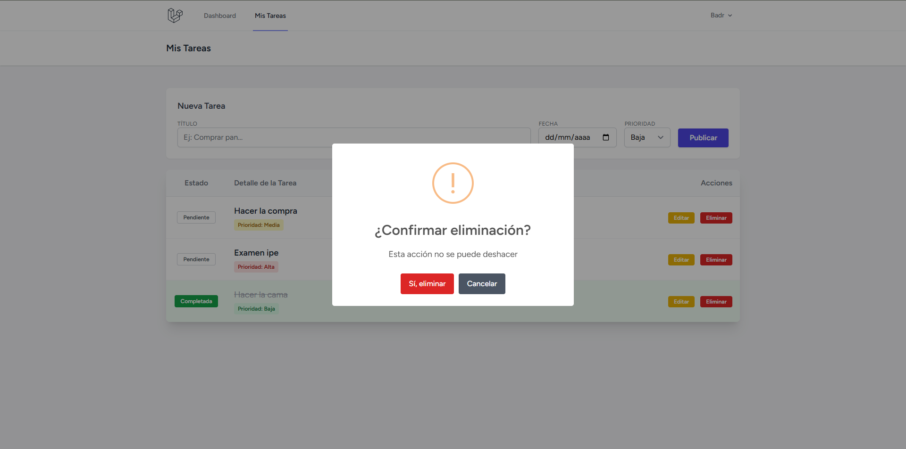

# Gestor de Tareas Avanzado (Laravel 12 + Breeze)

Aplicacion web completa desarrollada con **Laravel 12**, **Breeze** (Blade + Tailwind CSS) y **Alpine.js**. Permite a los usuarios registrarse y gestionar su lista de tareas personal con una interfaz moderna y reactiva.

Este proyecto va mas alla de un CRUD basico, implementando caracteristicas avanzadas de UX y seguridad.

## Caracteristicas Destacadas

* **Autenticacion Robusta:** Sistema completo de Login y Registro con Laravel Breeze.
* **Interfaz Moderna:** Diseno limpio usando Tailwind CSS.
* **Feedback Visual:**
    * Las tareas completadas se marcan en verde y tachadas.
    * Etiquetas de colores para la Prioridad (Alta, Media, Baja).
* **CRUD Completo y Logica Extra:**
    * **Crear:** Formulario rapido en la cabecera.
    * **Leer:** Listado ordenado (pendientes primero).
    * **Actualizar:** Edicion completa + Boton rapido de "Completar/Pendiente" (Toggle).
    * **Borrar:** Proteccion contra borrado accidental.
* **Seguridad:** Policies implementadas para que cada usuario solo pueda ver y editar sus propias tareas.
* **Alertas:** Integracion con SweetAlert2 para confirmaciones de eliminacion.

## Requisitos e Instalacion

1.  **Clonar el repositorio:**
    ```bash
    git clone <URL_DE_TU_REPO>
    cd gestion-tareas
    ```

2.  **Instalar dependencias (Backend y Frontend):**
    ```bash
    composer install
    npm install
    ```

3.  **Configurar Entorno:**
    * Copia el archivo .env.example a .env.
    * Configura tu base de datos (DB_DATABASE=tareas_db).
    * Genera la clave de aplicacion:
        ```bash
        php artisan key:generate
        ```

4.  **Base de Datos:**
    ```bash
    php artisan migrate
    ```

5.  **Ejecutar:**
    Necesitaras dos terminales abiertas:
    ```bash
    # Terminal 1 (Servidor PHP)
    php artisan serve

    # Terminal 2 (Compilador de estilos en tiempo real)
    npm run dev
    ```
    Accede a: http://127.0.0.1:8000

---

## Galeria de la Aplicacion

### 1. Login y Seguridad
Pantalla de acceso segura proporcionada por el stack de Breeze.


### 2. Panel de Tareas (Dashboard)
Vista principal. Se observa el formulario de creacion rapida, y la lista de tareas. Notese la diferenciacion visual entre tareas completadas y pendientes, asi como las etiquetas de prioridad.


### 3. Edicion de Tarea
Formulario dedicado para modificar los detalles de una tarea existente.


### 4. Seguridad en el Borrado
Implementacion de JavaScript (SweetAlert) para prevenir el borrado accidental de datos.



---

## Detalles Tecnicos
* **Modelo Tarea:** Campos tipados (string, text, boolean, date, integer).
* **Controlador:** Uso de Route Model Binding y validacion de Request.
* **Vistas:** Componentes Blade reutilizables.