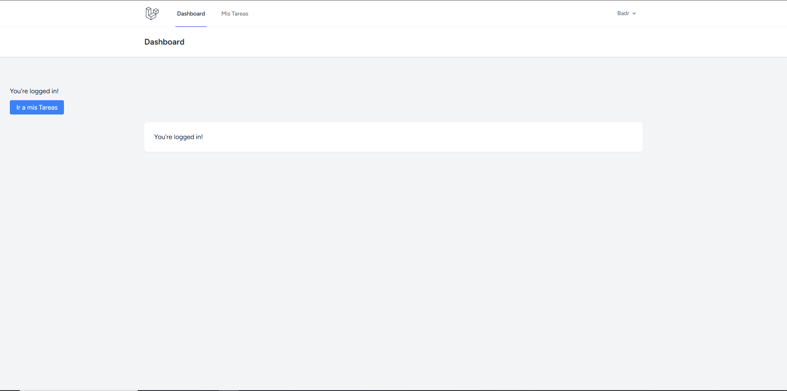
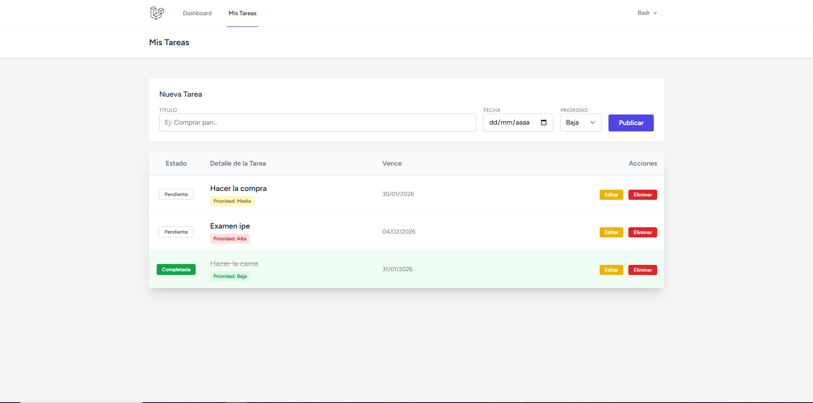
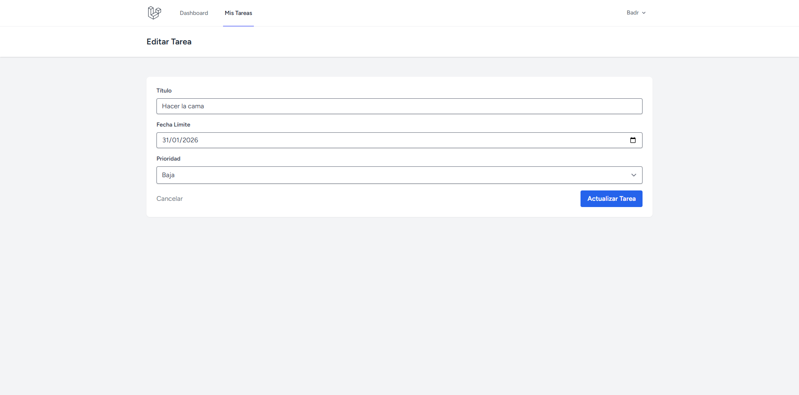
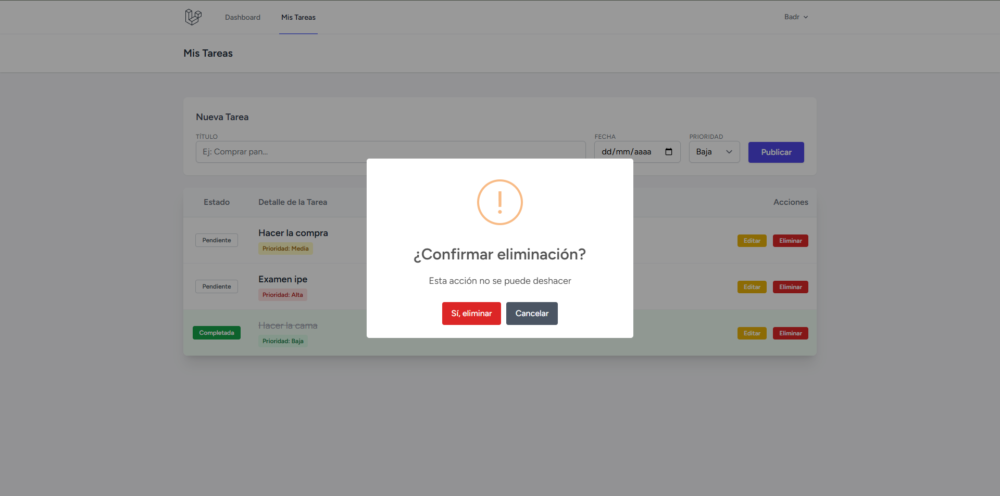

# Gestor de Tareas Avanzado (Laravel 12 + Breeze)

Aplicación web completa desarrollada con **Laravel 12**, **Breeze** (Blade + Tailwind CSS) y **Alpine.js**. Permite a los usuarios registrarse y gestionar su lista de tareas personal con una interfaz moderna y reactiva.

Este proyecto va más allá de un CRUD básico, implementando características avanzadas de UX y seguridad.

##  Características Destacadas

* **Autenticación Robusta:** Sistema completo de Login y Registro con Laravel Breeze.
* **Interfaz Moderna:** Diseño limpio usando Tailwind CSS.
* **Feedback Visual:**
    * Las tareas completadas se marcan en verde y tachadas.
    * Etiquetas de colores para la Prioridad (Alta, Media, Baja).
* **CRUD Completo y Lógica Extra:**
    * **Crear:** Formulario rápido en la cabecera.
    * **Leer:** Listado ordenado (pendientes primero).
    * **Actualizar:** Edición completa + Botón rápido de "Completar/Pendiente" (Toggle).
    * **Borrar:** Protección contra borrado accidental.
* **Seguridad:** *Policies* implementadas para que cada usuario solo pueda ver y editar sus propias tareas.
* **Alertas:** Integración con **SweetAlert2** para confirmaciones de eliminación.

##  Requisitos e Instalación

1.  **Clonar el repositorio:**
    ```bash
    git clone <URL_DE_TU_REPO>
    cd gestion-tareas
    ```

2.  **Instalar dependencias (Backend y Frontend):**
    ```bash
    composer install
    npm install
    ```

3.  **Configurar Entorno:**
    * Copia el archivo `.env.example` a `.env`.
    * Configura tu base de datos (`DB_DATABASE=tareas_db`).
    * Genera la clave de aplicación:
        ```bash
        php artisan key:generate
        ```

4.  **Base de Datos:**
    ```bash
    php artisan migrate
    ```

5.  **Ejecutar Proyecto:**
    Necesitarás dos terminales abiertas:
    ```bash
    # Terminal 1 (Servidor PHP)
    php artisan serve

    # Terminal 2 (Vite / Compilador de estilos)
    npm run dev
    ```
    Accede a: [http://127.0.0.1:8000](http://127.0.0.1:8000)

---

## 📸 Galería de la Aplicación

### 1. Login y Seguridad
Pantalla de acceso segura proporcionada por el stack de Breeze.


### 2. Panel de Tareas (Dashboard)
Vista principal con formulario de creación rápida y lista de tareas.


### 3. Edición de Tarea
Formulario dedicado para modificar los detalles de una tarea existente.


### 4. Seguridad en el Borrado
Implementación de SweetAlert2 para prevenir la pérdida accidental de datos.


## Detalles Técnicos

| Componente | Detalle |
| :--- | :--- |
| **Modelo Tarea** | Campos tipados: `string`, `text`, `boolean`, `date`, `integer`. |
| **Controlador** | Uso de *Route Model Binding* y validación mediante *Form Requests*. |
| **Seguridad** | Laravel Policies para el aislamiento de datos por usuario. |
| **Vistas** | Componentes Blade reutilizables y reactividad con Alpine.js. |